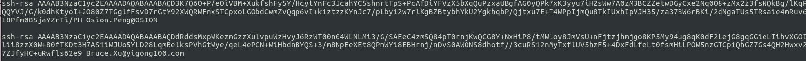

# Git 安装以及使用

1.  安装git
  * ``` sudo apt-get install git```
  
  
2.  生成 ssh key 
  * 设置名称 ```git config --global user.name "shaco"```
  * 设置email ``` git config --global user.email "shaco@zongshengtech.com"```
  * 生成 ssh public key ``` ssh-keygen -t rsa -C "shaco@zongshengtech.com"```不用设置密码，3个回车即可
  
  
3.  本地服务器增加Git 权限
  * 复制公钥信息  ```/home/www/shaco/.ssh/id_rsa.pub```
  * 进入 ```ssh root@192.168.1.4```
  * 将公钥复制进许可证   ```vi /home/git/.ssh/authorized_keys ``` 将自己的公钥信息粘贴到文件最后
      
  

4.  安装 git 查看工具  gitg
   * sudo apt-get install gitg

5.  windows git tortoisegit 中导出几个版本对比修改文件的替代方式
  * 通过命令进行对比并且进行打包操作,两种方式
      
     ① ```git diff HEAD HEAD~3 --name-only | xargs zip update.zip```  对前3个版本进行打包
    
     ② ```git archive -o update.zip HEAD $(git diff HEAD HEAD~3 --name-only)``` 
     
     
