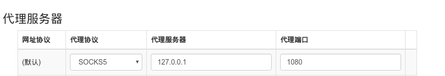

# 其他设置调整

1. 修改hostname, 否则终端打开时,@后的字符串占用位置太长不方便编辑.
    ```sudo vi /etc/hostname``` | 改成localhost 保存,重启生效
2.   浏览器访问代理 
   * chrome 安装插件 Proxy SwitchyOmega . 配置代理端口 
     
   * 从终端连入代理SSH地址 ``` ssh -qTfnN -D 1080 dullhuskey@118.193.192.213 ``` 输入密码链接成功 (连接后终端可关闭)
   * 再通过chrome 即可访问google 等网站
   

